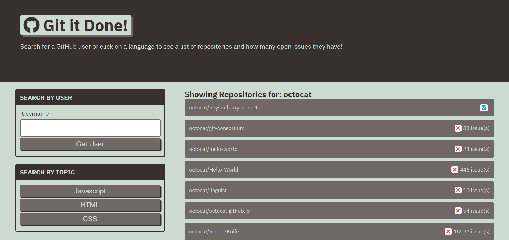
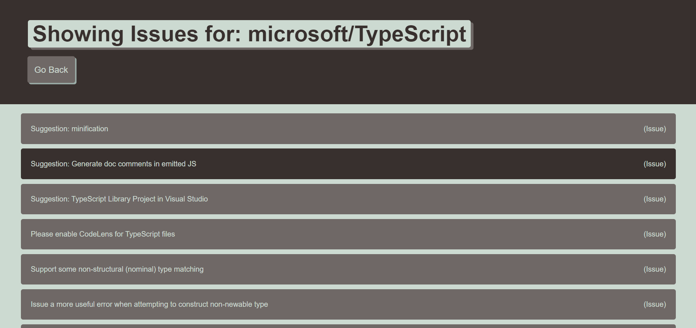

# git-it-done

## Description
Allows user to search for issues in GitHub repositories by GitHub username or by topic.  The results that are returned indicate the number of issues belonging to the repository, and provide links to the issues.

##### Search Result View

##### Issues View

Visit site [here](https://christopherconcannon.github.io/git-it-done/)

## Table of Contents
  * [Installation](#installation)
  * [Usage](#usage)
  * [License](#license)
  * [Technologies](#technologies)
  * [Contributing](#contributing)
  * [Testing](#testing)
  * [Questions](#questions)
  
## Installation
Clone project to a directory on your local machine and cd into git-it-done directory.  

## Usage
Open index.html file in browser of choice.  Enter a GitHub username in the input field or select a topic to search by.  Browse the results to find repositories with open issues.  When you select a repository you will be taken to a listing of the issues.  Click on the issue that interests you to be taken to that issue on GitHub  

## License 
This project is covered under the MIT license 

## Technologies 
HTML5, CSS3, JavaScript, GitHub API

## Contributing
To see the guidelines adopted for contributing to this project, please view the [Contributor Covenant](https://www.contributor-covenant.org/version/2/0/code_of_conduct/code_of_conduct.txt)

## Testing
Tests coming soon

## Questions
Visit me at GitHub  
[christopherConcannon](https://github.com/christopherConcannon)
  
If you have any questions or would like to contact me, please email me at  
[cmcon@yahoo.com](mailto:cmcon@yahoo.com)
